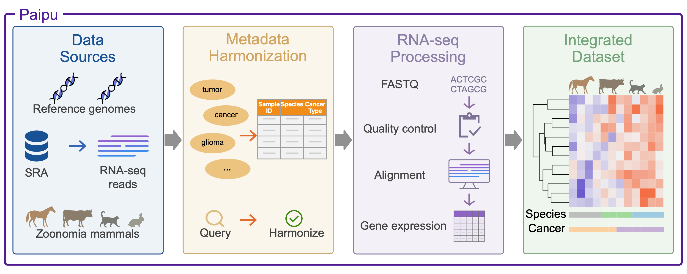
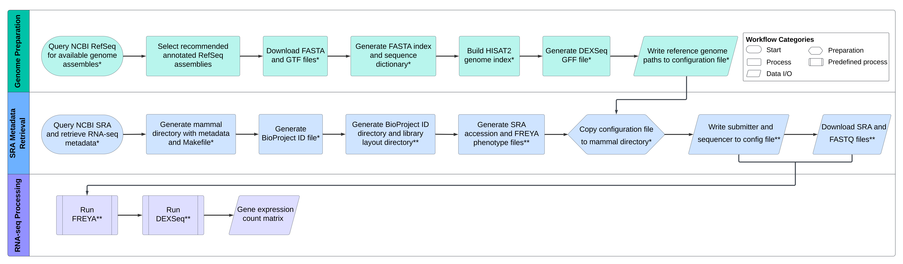

# The Paipu Framework
Paipu is a comprehensive pipeline designed to facilitate multi-species analysis by creating a harmonized atlas from user-defined search terms and species.
Paipu streamlines sample querying, preprocessing, harmonization, and retrieval of large-scale RNA-seq data and associated metadata from the NCBI Sequence Read Archive (SRA). The associated Paipu manuscript can be found [here](https://www.biorxiv.org/content/10.64898/2026.05.14.725161v1).

## Paipu Graphical Abstract


## Paipu Processing

### Input File 
The Paipu pipeline takes in a single input csv file containing the organisms and cancer types you would like to query. This file must be in the `input/` directory and must be named `query_input.csv`. A file to edit exists there currently. 
The input file must have 2 columns, the first is the species you would like to query and the second is the cancer type. 

The following input file (full example in `input/input_ex1.csv`) will query one cancer type for each species. 
```
Organisms, Cancer Type
Acinonyx jubatus,childhood central nervous system germ cell tumor
Acomys cahirinus,pulmonary inflammatory myofibroblastic tumor 
```
If you would like to query multiple cancer types for a species you may enter the species only once, and have additional cancers listed in the second column on subsequent rows (full example in `input/input_ex2.csv`):

```
Organisms,Cancer Types
Gorilla gorilla,childhood central nervous system germ cell tumor
,pulmonary inflammatory myofibroblastic tumor 
,pulmonary inflammatory myofibroblastic tumor
,childhood extracranial germ cell tumor
,paranasal sinus and nasal cavity cancer
,primary central nervous system lymphoma
```

### Running Paipu
Following input construction, Paipu will execute in three phases:
<br> (1) **Genome preparation**: Here Paipu downloads and preprocesses reference genomes for read
mapping.
<br> (2) **SRA metadata retrieval and harmonization**: During the SRA metadata retrieval phase, Paipu collects
relevant cancer metadata and sequence data.
<br> (3) **RNA-seq data processing**: Finally, in Paipu’s
RNA-seq data processing phase it uses the FREYA framework
to generate RNA-seq count data from the SRA raw read files.
<br> 



- **Genome preparation** is performed in `genome_prep/genome_prep.nf`. This script is called and actually executed in `genome_prep/run_genome_prep_slurm.sh`. <br> 
- **SRA metadata retrieval and harmonization** is performed in `sra_metadata_retrieval.py` called from `run_sra_retrieval.sh`. <br> 
- **RNA-seq data preprocessing** is run by calling FREYA which can be installed from [here](https://github.com/flatironinstitute/FREYA).

<br>

You can run the complete pipeline by running the script `genome_prep/run_genome_prep_slurm.sh`. This script makes a subsequent call to `run_sra_retrieval.sh` to execute the entire pipeline. The pipeline is built to run on a slurm-based compute cluster.

## Additional Scripts Used in Analysis 
Scripts used for additional analysis in the paper are in `analysis_scripts/`. Please see the `README.md` in that directory for more information. 