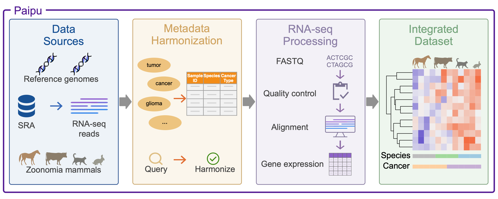
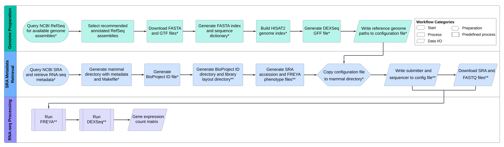
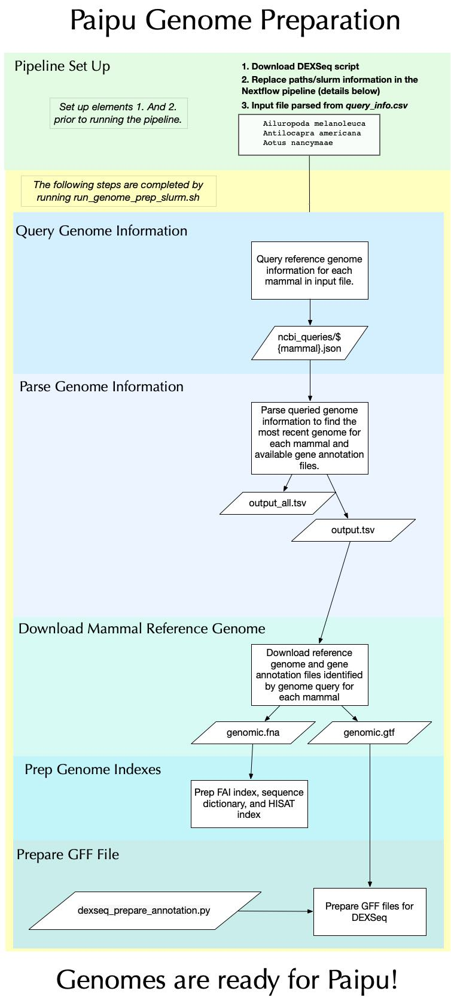

# The Paipu Framework

`Paipu` is a comprehensive pipeline designed to facilitate multi-species analysis by creating a harmonized atlas from user-defined search terms and species.

Paipu streamlines sample querying, preprocessing, harmonization, and retrieval of large-scale RNA-seq data and associated metadata from the NCBI Sequence Read Archive (SRA). It performs RNA-seq processing with [FREYA](https://github.com/flatironinstitute/FREYA) and generates count matrices for downstream analysis.

## Paipu Overview



For each organism specified in the input file, the pipeline:

1. Identifies and downloads an appropriate reference genome assembly and annotation.
2. Prepares the reference genome for downstream RNA-seq processing.
3. Queries NCBI SRA and retrieves and harmonizes sample metadata.
4. Groups samples by BioProject and library layout.
5. Prepares FREYA input files.
6. Downloads SRA sequencing data and converts reads to FASTQ.
7. Runs FREYA for each BioProject and sequencing layout pair.
8. Generates count matrices from the resulting DEXSeq counts.

## Requirements

Paipu is designed for execution on a SLURM HPC system and uses Nextflow DSL2.

The workflow uses the following software and modules:

* Nextflow 26.04.3
* NCBI Datasets CLI
* Python 3.10
* SRA Toolkit 3.2.1
* HISAT2 2.2.1
* SAMtools
* Picard
* HTSeq 2.0.3
* R 4.5
* DisBatch 2.5
* FREYA and its associated dependencies

Software is currently loaded using environment modules. Module names and versions may need to be modified when running the pipeline on a different HPC system.

## Setup

Clone the repository and move into the pipeline directory:

```bash
git clone https://github.com/GraimLab/Paipu.git
cd Paipu
```

Download `dexseq_prepare_annotation.py` from the [Trinity RNA-Seq repository](https://github.com/trinityrnaseq/trinityrnaseq/blob/master/trinity-plugins/DEXseq_util/dexseq_prepare_annotation.py) and place it in the main pipeline directory.

## Input files

Pipeline input files are located in the `input/` directory.

### `query_info.csv`

`query_info.csv` defines the organisms and SRA search information used by the pipeline.

The first column contains the organism name. Organisms listed in this file are used for both reference genome discovery and SRA metadata retrieval. The second column contains the search terms (e.g. a disease such as cancer). 

The following input file (full example in `input/input_ex1.csv`) will query one cancer type for each species. 
```
Organisms, Cancer Type
Acinonyx jubatus,childhood central nervous system germ cell tumor
Acomys cahirinus,pulmonary inflammatory myofibroblastic tumor 
```
If you would like to query multiple cancer types for a species you may enter the species only once, and have additional cancers listed in the second column on subsequent rows (full example in `input/input_ex2.csv`):

```
Organisms,Cancer Types
Gorilla gorilla,childhood central nervous system germ cell tumor
,pulmonary inflammatory myofibroblastic tumor 
,pulmonary inflammatory myofibroblastic tumor
,childhood extracranial germ cell tumor
,paranasal sinus and nasal cavity cancer
,primary central nervous system lymphoma
```

### `exclude_cols.csv`

`exclude_cols.csv` contains SRA metadata columns that should be excluded when searching for terms during metadata processing and harmonization.

## Running Paipu

The pipeline is launched using the SLURM script rather than by calling Nextflow directly.

### 1. Configure the pipeline

Pipeline paths, input files, scripts, computational resources, and SLURM settings are defined in `nextflow.config`.

Before running the pipeline on a new HPC system, review the SLURM options in `nextflow.config`. Update the SLURM account and QOS values:

```groovy
clusterOptions = '--account=<account> --qos=<qos>'
```

Update the email address in `run_paipu_slurm.sh`:

```bash
#SBATCH --mail-user=<your_email>
```

The SRA metadata retrieval step uses the NCBI Entrez API. Set the appropriate email address and API key in `run_paipu_slurm.sh`:

```bash
export ENTREZ_EMAIL="<your_email>"
export ENTREZ_API_KEY="<your_api_key>"
```

### 2. Submit the pipeline

From the root pipeline directory, submit:

```bash
sbatch run_paipu_slurm.sh
```

The SLURM script obtains the organisms to process from `query_info.csv`, queries NCBI for suitable genome assemblies and annotations, and launches the Nextflow workflow.

The underlying Nextflow command is:

```bash
nextflow run paipu.nf -resume -c nextflow.config
```

The `-resume` option allows Nextflow to reuse successfully completed tasks from previous runs.


## Workflow steps



### 1. Reference genome preparation



For each organism, the pipeline identifies and downloads a reference genome assembly and its annotation from NCBI. The genome is indexed with SAMtools and HISAT2, the sequence dictionary is generated with Picard and the annotation is formatted for DEXSeq.

These files are used for downstream RNA-seq processing.

> **Note:** Organisms without a reference genome containing a gene annotation require manual handling. In these cases, an annotation from [TOGA](https://genome.senckenberg.de/download/TOGA/) may be used, or an alternative genome assembly with an available gene annotation can be selected. When using a TOGA annotation, chromosome names should be checked to ensure they match the reference genome.


### 2. SRA metadata retrieval and harmonization

The pipeline queries NCBI SRA for each organism using the search information provided in `query_info.csv`. Retrieved metadata is processed and harmonized.

The resulting metadata is used to organize samples by BioProject and prepare them for downstream processing.

### 3. FREYA input preparation

Samples are grouped by BioProject and organized based on sequencing layout (`single` or `paired`).

For each BioProject and sequencing layout, the pipeline generates the SRA accession lists, phenotype files and configuration files required for FREYA. Specific BioProject information, such as sequencer and submitter metadata, is also added to the configuration file.

### 4. SRA download and FASTQ conversion

SRA files are downloaded for each sample and converted to FASTQ format.

### 5. FREYA RNA-seq processing

FREYA is run for each BioProject and sequencing layout pair using the reference genome and annotation prepared earlier in the workflow.

### 6. Count matrix generation

After FREYA processing, DEXSeq count outputs are combined to generate count matrices for each BioProject and sequencing layout pair.


## Output structure

Paipu's results are stored in:

```text
results/
```

Results are organized first by organism.

Reference genome files are stored in the corresponding organism's genome accession and assembly directory:

```text
results/
└── <organism>/
    └── <accession>__<assembly>/
        ├── genomic.fna
        ├── genomic.fna.fai
        ├── genomic.dict
        ├── genomic.gtf
        ├── DEXSeqGff.gff
        └── hisat2/
            ├── genomic.1.ht2
            ├── genomic.2.ht2
            └── ...
```

SRA metadata and results for each BioProject are stored in the organism directory:

```text
results/
└── <organism>/
    ├── <organism>.csv
    ├── SRA_metadata.tsv
    ├── bioproject_info.csv
    ├── <accession>__<assembly>/
    │   ├── genomic.fna
    │   ├── genomic.fna.fai
    │   ├── genomic.dict
    │   ├── genomic.gtf
    │   ├── DEXSeqGff.gff
    │   └── hisat2/
    │       └── ...
    ├── PRJ.../
    │   ├── single/
    │   │   └── ...
    │   └── paired/
    │       └── ...
    └── PRJ.../
        └── ...
```

`single/` and `paired/` directories are created based on the sequencing layouts present in each BioProject.

## Logs and reports

Nextflow execution reports are stored in `logs/` and SLURM output and error logs are stored in `slurm_logs/`.


## Restarting an interrupted or failed run

Paipu is launched with Nextflow's `-resume` option.

To restart the pipeline after an interruption or error, resubmit the SLURM job using:

```bash
sbatch run_paipu_slurm.sh
```

Nextflow will reuse cached results from successfully completed tasks when possible instead of rerunning the entire workflow.

Keep the `work/` directory so completed tasks can be reused if the pipeline needs to be restarted.

## Repository structure

The main files and directories used by Paipu are organized as follows:

```text
.
├── paipu.nf
├── nextflow.config
├── run_paipu_slurm.sh
│
├── dexseq_prepare_annotation.py
├── sra_metadata_retrieval.py
│
├── input/
│   ├── query_info.csv
│   └── exclude_cols.csv
│   └── input_ex1.csv
│   └── input_ex2.csv
│
├── ncbi_queries/
│   └── query.sh
│
├── scripts/
│   ├── binSamples.sh
│   ├── freya_phenotype.sh
│   ├── make_config.sh
│   ├── download_sra_from_list.sh
│   ├── freya_slurm_script.sh
│   ├── freya_slurm_script_paired.sh
│   ├── master_script.sh
│   ├── master_paired_script.sh
│   ├── DESeq_count_matrix.sh
│   └── DEXSeq.R
│
├── images/
│   ├── paipu_graphical_abstract.png
│   └── paipu_workflow.png
│   └── PaipuWorkflowVis.jpg
│
├── results/
├── logs/
├── slurm_logs/
└── work/
```

### Main workflow files

| File | Description |
| ------------------------------ | ------------------------------------------------------------------------------------------ |
| `paipu.nf` | Main Nextflow workflow |
| `nextflow.config` | Pipeline parameters, SLURM configuration, computational resources and reporting settings |
| `run_paipu_slurm.sh` | Main SLURM submission script |
| `sra_metadata_retrieval.py` | Queries NCBI SRA and harmonizes retrieved metadata |
| `dexseq_prepare_annotation.py` | Converts the reference GTF annotation into the format required by DEXSeq |

### Supporting scripts

| Script | Purpose |
| ------------------------------ | ----------------------------------------------------------- |
| `binSamples.sh` | Organizes SRA samples by BioProject and sequencing layout |
| `freya_phenotype.sh` | Creates FREYA phenotype files |
| `make_config.sh` | Creates FREYA configuration files for each BioProject and sequencing layout pair |
| `download_sra_from_list.sh` | Downloads SRA files and converts them to FASTQ |
| `freya_slurm_script.sh` | Runs FREYA for single-end data |
| `freya_slurm_script_paired.sh` | Runs FREYA for paired-end data |
| `master_script.sh` | FREYA master workflow for single-end data |
| `master_paired_script.sh` | FREYA master workflow for paired-end data |
| `DESeq_count_matrix.sh` | Runs the count matrix step after FREYA processing |
| `DEXSeq.R` | Combines DEXSeq count outputs into count matrices |

