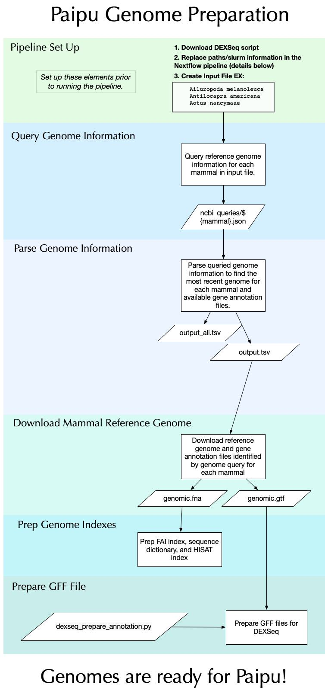

# Paipu Genome Processing Overview


# Steps to running the pipeline to prep genomes for the Paipu pipeline
The following steps are described assuming the workdir is: `Paipu/genome_prep/`

## 1) Make input file with list of mammals you would like to prep genomes for called input.txt. 
Example:

```
	Ailuropoda melanoleuca
	Antilocapra americana
	Aotus nancymaae
	Bos mutus
	Bos taurus
	Bubalus bubalis
	Callithrix jacchus
	Canis lupus familiaris
	Capra hircus
	Carollia perspicillata
```
NOTE: The pipeline below expects input file (`input.txt`) to be created with the format described above and in the `genome_prep` directory. 

**All of the following steps are executed within the master slurm script (`run_genome_prep_slurm.sh`).**
 
 ## 2) Run script `run_genome_prep_slurm.sh`.
 The script `run_genome_prep_slurm.sh` is a slurm script and used to run the remainder of the pipeline. This script will do the following: 
 ```
1. Query all mammals provided in `input.txt`
2. Parse the queries to find mammals with a valid reference genome and gene annotation file
3. Prep mammals with valid genomes for use in Paipu (described further below). 
```
### **Prior to running `run_genome_prep_slurm.sh` please ensure that you have done the following:**
- Created the correct input file
- Downloaded the [DEXSeq preparation python script here](https://github.com/trinityrnaseq/trinityrnaseq/blob/master/trinity-plugins/DEXseq_util/dexseq_prepare_annotation.py)
- Edited/entered the correct slurm account information at the top of `run_genome_prep_slurm.sh` and added the slurm account information in the TODOs noted in the nextflow.config file.

### **Script run_genome_prep_slurm.sh workflow**
 1. Input file `input.txt` is taken as input into `ncbi_queries/query.sh` to query reference genome information for each mammal. `ncbi_queries/query.sh` is run for each mammal listed in `input.txt` and outputs a json file containing all available genome information for the mammal such:
	- date of release
	- whether the genome has gene annotations
	- assembly name
json files for each queried mammal are stored in `ncbi_queries/`. 

2. After creating the initial mammal's json file,`ncbi_queries/query.sh` then calls `ncbi_queries/json_parse.sh` which parses each json file to identify the current recommended reference genome for the mammal and whether the genome has a gene annotation file. Results for all queried genomes are in `ncbi_queries/query_output_all.csv`. Genomes that have a gene annotation can be prepped for Paipu - these genomes are written to `query_output_valid.csv`

`query_output_valid.csv` has the following columns (these headers are not written in the `query_output_valid.csv` file at the moment):
`mammal_name, genome_accession, assembly_name, assembly_status, release_date, has_gene_annotation, gene_annotation_proivder, gene_annotation_release_date`

3. `query_output_valid.csv` is what the `genome_prep.nf` nextflow pipeline expects as input.
`genome_prep.nf` prepares each mammalian genome by:	
```
	1) Downloading genome and gene annotation files for given mammal.
	2) Creating `.fai` and `.dict` files.
	3) Building the indexes needed for hisat2.
	4) Creating `.gff` files needed for DexSeq.
```

NOTE: There are several options for queried mammalian genomes that do not currently have a gene annotation file:
1) The current reference genome may have a corresponding . We use the `human_hg38_reference/` for one of our mammals. If using these annotations you must check to ensure chromosomes match the downloaed genome fasta file. Often times the chromosomes do not match exactly, however a simple replacement using sed or awk can get them to match (for example the chromosomes may match except maybe the TOGA annotation has ad additional ".1" suffix or "chr" prefix.).
2) Another option is to use a different genome other than the reference that may have a corresponding gene annotation. 

We initially tried to accomodate all these query options in the pipeline, however due to the inconsistencies in TOGA chromosome matching and many additional constraints in choosing additional genomes to use for a given mammal, we decided this is best done manually to ensure correctness.
